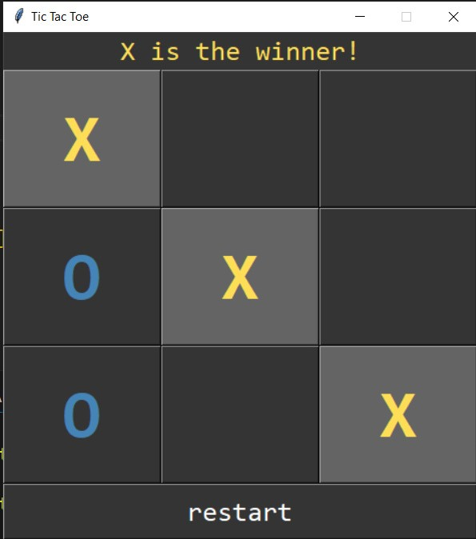

## Welcome to my GitHub Pages site! Here, you'll find a collection of my personal projects, ranging from games to utility tools. Feel free to explore and use the tools I've built. 🎉

## 🚀 **Projects**

### 1. [Tic Tac Toe](https://github.com/HimanshuChaudhery/Tic-Tac-Toe/)

A Simple and colorful game implemented in Python using Tkinter Library, play against a friend and enjoy the nostalgic feeling.

---

### 2. [Weather App](https://github.com/HimanshuChaudhery/Weather-App/)

A simple Weather application will show weather details with images, location and brief description of the weather.

---

### 3. [To Do List](https://github.com/HimanshuChaudhery/To-Do-List/)

A simple yet effective To-Do List Application that helps users manage and organize their daily tasks.

---

### 4. [GUI Calculator](https://github.com/HimanshuChaudhery/GUI-Calculator/)

A basic calculator application with a user-friendly interface to perform simple arithmetic operations like addition, subtraction, multiplication, and division.

---

## 🌟 **Explore More**

Visit [Himanshu Chaudhery's GitHub Profile](https://github.com/HimanshuChaudhery) for more repositories and updates.

---
